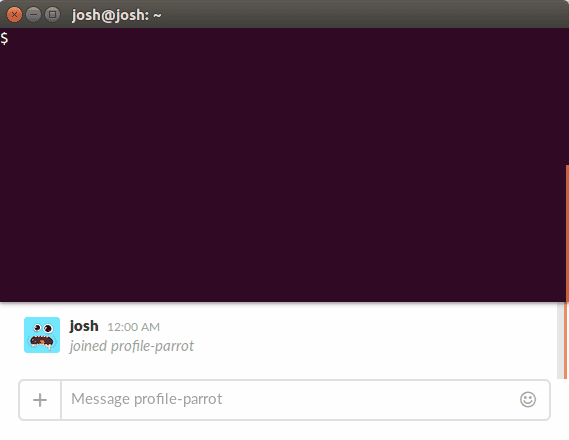

# profile parrot [](https://travis-ci.org/joshheinrichs/profile-parrot)
Bring the party to your Slack photo!

[](docs/demo.gif)

## Installing 

Either grab a build on the [releases page](https://github.com/joshheinrichs/profile-parrot/releases) or run:

```bash
$ go get -u github.com/joshheinrichs/profile-parrot
$ go generate github.com/joshheinrichs/profile-parrot
$ go install github.com/joshheinrichs/profile-parrot
```

Requires [bindata](https://github.com/jteeuwen/go-bindata) to build.

## Usage

```bash
$ profile-parrot -slack-token SLACK_TOKEN [-parrot PARROT_GIF] [-h]
```

Slack tokens can be generated at https://api.slack.com/custom-integrations/legacy-tokens
